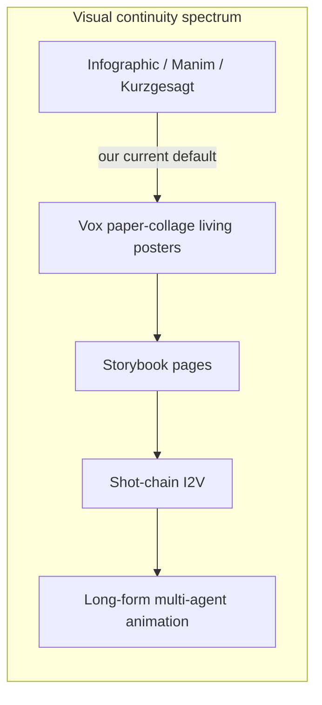
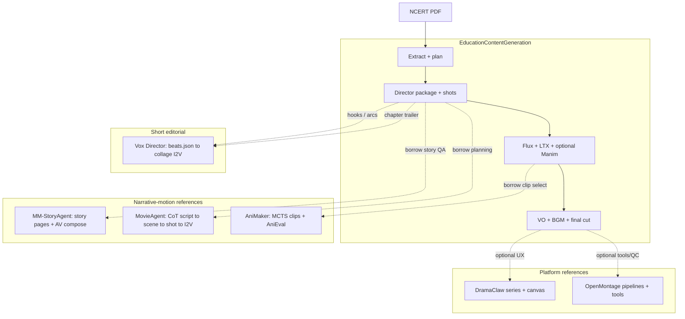
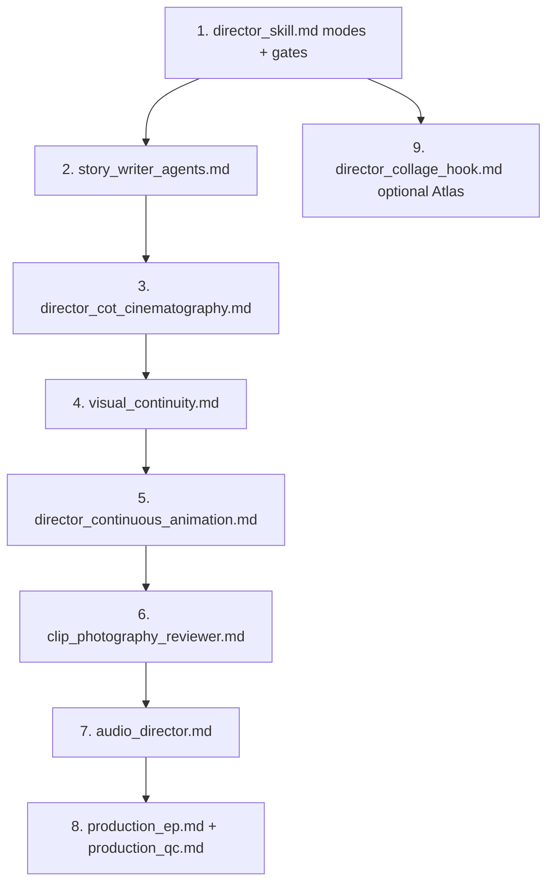

# Video production modules — comparison

This document compares **our NCERT / textbook pipeline** (EducationContentGeneration) with reference systems under `scripts/`, with emphasis on **continuous, story-driven motion** (AniMaker / MovieAgent style) versus **infographic / slide-style explainers**.

| Module | Path | Upstream |
|--------|------|----------|
| **Us (textbook pipeline)** | repo root + `scripts/` | Internal |
| **Anim-Director / AniMaker** | `scripts/Anim-Director/` | [HITsz-TMG/Anim-Director](https://github.com/HITsz-TMG/Anim-Director) |
| **MM-StoryAgent** | `scripts/MM_StoryAgent/` | [X-PLUG/MM_StoryAgent](https://github.com/X-PLUG/MM_StoryAgent) |
| **MovieAgent** | `scripts/MovieAgent/` | [showlab/MovieAgent](https://github.com/showlab/MovieAgent) |
| **DramaClaw** | `scripts/dramaclaw/` | [dramaclaw/dramaclaw](https://github.com/dramaclaw/dramaclaw) |
| **OpenMontage** | `scripts/OpenMontage/` | [calesthio/OpenMontage](https://github.com/calesthio/OpenMontage) |
| **Vox Director** | `scripts/vox-director/` | [Alisa0808/vox-director](https://github.com/Alisa0808/vox-director) |

**Legend:** ✅ Strong · ◐ Partial · ❌ Missing / not a focus · — Not applicable

---

## What we want next: continuous flow, not infographics

**Today our default product shape** is an **8–10 minute NCERT explainer** (`scripts/knowledge/director_skill.md`): hook → beats → mechanism → payoff, with visuals tuned to **top YouTube explainer channels** (Kurzgesagt-style layered graphics, scene table, on-screen text). Pixel stages (**Flux keyframes → LTX clips**, optional **Manim** math inserts) often read as **illustrated explainers** — strong for syllabus accuracy, weaker for **unbroken character action** across minutes.

**Target direction (your ask):** closer to **AniMaker’s continuous storytelling animation** — multi-scene narrative, characters that **act across shots**, clip-to-clip coherence, post-production that **stitches motion** rather than panning stills.

| Style | Typical motion | Best references for us |
|-------|----------------|------------------------|
| **Infographic / explainer** | Ken Burns on art, diagram builds, Manim, title cards | Our director skill today; OpenMontage animated explainer + Remotion |
| **Storybook / page narrative** | Page-turn story, parallel image+speech+SFX+music compose | [MM-StoryAgent](https://github.com/X-PLUG/MM_StoryAgent) |
| **Shot-chain cinema** | Per-shot I2V, hierarchical script→scene→shot CoT, concat | [MovieAgent](https://github.com/showlab/MovieAgent) |
| **Long-form animation research** | Multi-agent + MCTS clip candidates + AniEval + VO | AniMaker in `scripts/Anim-Director/AniMaker/` |
| **Episodic drama factory** | Beats, asset library, many video models | DramaClaw |
| **Editorial collage explainer (short)** | One collage poster per beat → I2V “living poster” | [Vox Director](https://github.com/Alisa0808/vox-director) |



**Where Vox Director fits:** It is **not** full character-acting continuity (AniMaker/MovieAgent). It **is** a polished **short explainer** path (often 15–60 s): beat map → collage keyframe → animate poster → VO/music → ffmpeg. Useful for **hooks, chapter trailers, or “myth_buster / how_it_works” micro-lessons** while the main unit stays long-form cinematic.

**Recommended hybrid for NCERT (keep PDF spine, change motion grammar):**

1. Keep **PDF → plan → director brief → syllabus gates** (our moat).
2. Replace or supplement “one keyframe per beat” with **MovieAgent-style hierarchical CoT**: sub-script → scenes → shots with **character + emotional tone + cinematography** fields before LTX.
3. Add **AniMaker-style** multi-candidate LTX per shot + reviewer scoring (even 2–3 takes per shot).
4. Optionally use **MM-StoryAgent’s** registered-tool pattern for **parallel modality agents** (speech / music / SFX) while video moves to true I2V chain.
5. Use Manim **only** for explicit mechanism diagrams, not as the main visual language.

---

## Executive summary

| Dimension | **Us (today)** | **AniMaker** | **MM-StoryAgent** | **MovieAgent** | **Vox Director** | **DramaClaw** | **OpenMontage** |
|-----------|----------------|--------------|---------------------|----------------|------------------|---------------|-----------------|
| **Primary goal** | PDF → syllabus explainer video | Long coherent **animation** from text | **Storybook** video (topic → pages) | **Movie-length** multi-shot from script + cast bank | **Vox-style collage** explainer/ad from one topic | AI drama / series pipeline | General agentic studio |
| **Typical duration** | 8–10 min | Minutes (short film) | Pages × ~few sec | Long multi-shot | **15–60 s** (extendable) | Episode-length | Variable |
| **Motion continuity** | ◐ LTX from keyframes; Manim inserts | ✅ clip chain + selection | ◐ slideshow + motion on stills | ✅ per-shot I2V concat | ◐ **poster I2V** per beat (not character arc) | ✅ multi-shot compose | ◐ pipeline-dependent |
| **LLM agent pattern** | Staged scripts (director batches) | Multi-agent + MCTS + review | Multi-agent story + **parallel modality** workers | **Hierarchical CoT** agents (writer / scene / shot) | **Agent skill** (`SKILL.md`) + stage scripts | Xia Director + task pipeline | Skill files + tool registry |
| **Orchestration** | Python stages + `run.sh` | Research Python stack | YAML config + `run.py` | `movie_agent/run.py` + tools | `beats.json` + `scripts/*.py` + ffmpeg | FastAPI + tasks + canvas | Agent + YAML pipelines |
| **Input we care about** | **NCERT PDF** | Short story | Story topic / setting | `script_synopsis.json` + character photos | One-line **topic** (or A-roll video / C-roll photo) | Manuscript / Fountain | Prompt / reference video |
| **Local stack fit** | ✅ Qwen vLLM + Flux/LTX | Heavy GPU bench | SDXL + CosyVoice + MusicGen (configurable) | GPT-4o + ROICtrl + Hunyuan I2V | **Atlas Cloud API** + local ffmpeg/Pillow | Gateway APIs | Mixed local + APIs |
| **License (upstream)** | — | Check repo | **Apache-2.0** | Check repo | **MIT** | Elastic 2.0 | AGPLv3 |

---

## Positioning



---

## Our pipeline (EducationContentGeneration)

**What it is:** A **deterministic, stage-gated** pipeline from textbook PDF to finished MP4, optimized for **Indian school syllabus content** (DIKSHA IDs, chapter/subchapter structure) with a focus on **watchable motion** (I2V clips, timing, audio sync)—not a fixed mascot or cast system.

**Director intent today:** `scripts/knowledge/director_skill.md` implements **explainer-channel pacing** (hook, turns every 40–60 s, mechanism engine) — excellent for **education rubrics**, not the same as **scene-continuous animation**.

**Entry points:**

- `scripts/run_textbook_pipeline.py` — book-level: extract → plan → (optional) series bootstrap → scripts
- `scripts/run_textbook_director.py` — per-video LLM: directing package → shot decomposition → topic specs → screenplay → storyboard
- `scripts/run_textbook_pixels.py` — GPU: Flux keyframes → LTX cinematic clips (optional Manim math inserts)
- `scripts/run_pipeline.py` — shared chapter-to-movie stages (QC, audio, mux)
- `run.sh` — operational recipe (vLLM wrapper, BGM, pixels, stages 5c–7)

**Typical artifact tree** (`output/textbooks/<book_id>/videos/<video_id>/`):

| Stage | Key outputs |
|-------|-------------|
| Ingest | `manifest.json`, `extracted/chapters.json` |
| Plan | `video_plan.json` |
| Style / identity (optional) | `series_profile/series_profile.json` — palette, tone, prompt anchors when you want a stable look |
| Director | `directing/directing_package.json`, `shots/shot_decomposition.json` |
| Script | `topic_specs/`, `screenplay/`, `storyboard/` |
| Pixels | `shots/keyframes/`, `cinematic_videos/` |
| Audio / finish | `background_audio/`, `audio/`, `final_cut/*.mp4` |

**Shared stage model** (`scripts/lib/pipeline_utils.py`): `dir` → `1` math specs → `2` screenplay → `3` series profile → `4` storyboard → `5a` cinematic → `5b` Manim → `6`/`6b` audio → `7` final cut.

**Strengths (keep)**

- PDF-native workflow; director brief grounded in chapter text.
- Shot decomposition ties VO, timing, and generation prompts to ~8–10 min runtime.
- Local Qwen + local Flux/LTX.

**Gaps (vs continuous narrative goal)**

- Visual plan optimized for **explainer beats**, not **sub-script → scene → shot** film grammar (see MovieAgent).
- Single LTX take per shot — no **MCTS / multi-candidate** selection (see AniMaker).
- No **page-parallel modality orchestration** pattern (see MM-StoryAgent `spawn` workers for speech/music/image/sound).
- Manim path reinforces **diagram / infographic** feel when overused.

---

## Anim-Director & AniMaker

**Upstream:** [Anim-Director](https://github.com/HITsz-TMG/Anim-Director) (SIGGRAPH Asia 2024) → [AniMaker](https://arxiv.org/abs/2506.10540) (SIGGRAPH Asia 2025).

| Subproject | Role |
|------------|------|
| `Anim-Director/Anim-Director/` | LMM director: narrative → script → scene images → I2V; GPT reflection on quality |
| `Anim-Director/AniMaker/` | **Director → Photography (MCTS-Gen) → Reviewer (AniEval) → Post-Production** |

**Why it matches “continuous flow”:** Clips are generated as a **sequence with global story-level consistency checks**, not independent slides. Photography agent explicitly searches multiple candidates and selects high-potential continuations.

**Borrow for us:** MCTS-style multi-LTX generation; AniEval-like gates before mux; post-production agent for transitions + VO lock.

**Caveat:** No PDF ingest; research env weight (Wan, eval bench).

---

## MM-StoryAgent

**Upstream:** [X-PLUG/MM_StoryAgent](https://github.com/X-PLUG/MM_StoryAgent) — *Immersive Narrated Storybook Video Generation with a Multi-Agent Paradigm across Text, Image and Audio* (Apache-2.0).

**Local entry:** `scripts/MM_StoryAgent/run.py -c configs/mm_story_agent.yaml`

**Flow** (`mm_story_agent/mm_story_agent.py`):

1. **`story_writer`** — e.g. `qa_outline_story_writer`: multi-turn **asker + expert** LLM dialogue → outline → chapter pages (strong on **Education** rubric in their eval tables).
2. **`generate_modality_assets`** — **parallel processes** for image, sound, speech, music; writes `script_data.json`.
3. **`video_compose`** — `slideshow_video_compose`: Ken Burns–style slideshow (configurable fps, fades, caption font).

**Default tools in sample config:** StoryDiffusion T2I, CosyVoice TTS, AudioLDM2 SFX, MusicGen, Qwen LLM hooks.

| Topic | MM-StoryAgent | Us |
|-------|---------------|-----|
| Agent extensibility | `@register_tool` + YAML swap | Fixed stage scripts |
| Story quality pipeline | QA outline + multi-turn refinement | Single-shot / staged director |
| Education-focused writing | Explicit story topics + GPT-4 rubrics | NCERT accuracy constraints in director skill |
| Video motion | **Storybook slideshow** (not full I2V chain) | LTX **motion clips** from keyframes |
| Parallel modalities | ✅ built-in | Sequential stages in `run.sh` |

**Role in our roadmap:** Best **template for agent composition and customizable tools**, and **story QA** when turning chapter facts into a **narrated visual sequence** (not a slide deck). Upgrade path: keep their orchestration pattern but **swap slideshow compose for MovieAgent/AniMaker shot I2V** for true **clip-to-clip** continuity.

---

## MovieAgent

**Upstream:** [showlab/MovieAgent](https://github.com/showlab/MovieAgent) — *Automated Movie Generation via Multi-Agent CoT Planning* ([arXiv:2503.07314](https://arxiv.org/abs/2503.07314)).

**Local entry:** `scripts/MovieAgent/movie_agent/run.py` (+ `script/run.sh`)

**Hierarchical CoT agents** (`ScriptBreakAgent` in `movie_agent/run.py`):

| Step | Agent | System prompt key | Output artifact |
|------|--------|-------------------|-----------------|
| 1 | Screenwriter | `screenwriterCoT-sys` | `Step_1_script_results.json` (sub-scripts, relationships) |
| 2 | Scene planner | `ScenePlanningCoT-sys` | Scene annotations per sub-script |
| 3 | Shot creator | `ShotPlotCreateCoT-sys` | Per-scene **Shot Annotation** (plot, characters, subtitles, cinematography) |
| 4 | Tooling | ROICtrl / StoryDiffusion + I2V (SVD, HunyuanVideo_I2V, …) | Per-shot media |
| 5 | Assembly | `concatenate_videoclips` | `final_video.mp4` |

**Inputs:** `dataset/<movie>/script_synopsis.json` + optional **identity bank** (photos/audio per named subject) — maps to our optional **reference bank** + series profile when you need locked subjects; MovieAgent expects **per-subject folders** and relationship-aware CoT.

| Topic | MovieAgent | Us |
|-------|------------|-----|
| Planning depth | **Explicit CoT per sub-script / scene / shot** | Director package + shot decomposition (less hierarchical) |
| Subject / look consistency | ROICtrl / StoryDiffusion + photo bank | Flux/LTX prompts + optional refs + series tone profile |
| Subtitles / dialogue | Per-shot subtitle maps in shot JSON | VO in `narration_manifest.json` |
| Long-form concat | ✅ native | ✅ `assemble_final_cut.py` |
| Syllabus | ❌ | ✅ |

**Role in our roadmap:** Primary blueprint for **replacing infographic scene tables** with **film-structure JSON** before LTX — map each NCERT unit to a **sub-script** (e.g. one mechanism arc) and generate shots with **emotional tone, blocking, and camera intent** on every shot.

---

## DramaClaw

**What it is:** Source-available **AI drama production line** — Series pipeline + XiaHua canvas + Xia Director ([README](https://github.com/dramaclaw/dramaclaw)).

**Motion / narrative:** Multi-shot episode compose, asset-library identity, Director World (3DGS sets) — **continuous drama** at product level, not explainer slides.

**Vs us:** Strong **UI + asset library + task resume**; weak **PDF/syllabus** without adapters. Gateway-centric inference vs our local Qwen/LTX.

**Borrow:** Asset promotion, task center, scene-360 if recurring **locations** must stay spatially consistent across shots.

---

## OpenMontage

**What it is:** Agentic studio — YAML `pipeline_defs/`, director skills, large `tools/` registry, Backlot board.

**Vs continuous narrative:** **Animated explainer** and **Remotion/HyperFrames** paths can still feel **motion-graphics / slide** unless you choose **cinematic** or **character-animation** pipelines. **Documentary montage** is real-footage continuity, not cartoon acting.

**Borrow:** QC self-review, stock montage for history/geo units, provider registry for optional cloud I2V fallbacks.

---

## Vox Director

**Upstream:** [Alisa0808/vox-director](https://github.com/Alisa0808/vox-director) — MIT agent skill for **Vox-style paper-collage** explainers/ads on **Atlas Cloud** + local **ffmpeg** (see [README](https://github.com/Alisa0808/vox-director)).

**Local tree:** `scripts/vox-director/` — workflow in `SKILL.md`, creative specs in `references/beat-layer.md` and `references/prompt-guide.md`, stage scripts in `scripts/` (e.g. `keyframes.py`, `motion.py`, `assemble.py`).

**Pipeline (B-roll — topic in, `mp4` out):**

```
topic → beat map (beats.json)     [GATE 1: approve beats]
     → style bake-off (3–4 themes) [GATE 2: pick look]
     → collage poster per beat     (nano-banana-2 T2I)
     → animate poster              (gemini-omni-flash i2v; Kling for real people)
     → VO + music                  (xai/tts, minimax/music)
     → assemble                    (ffmpeg: concat, duck, captions)
     → final.mp4
```

**Other input modes (same engine):**

| Mode | Input | Use case |
|------|--------|----------|
| **A-roll** | Existing talking-head video | ASR → beats → collage restyle (video-edit / reference-to-video) |
| **C-roll** | Single photo | Photo as sticker in collage (`nano-banana-2/edit`); optional voice clone |

**Design principles (from upstream):**

1. **Look lives in the image step** — each beat is a full collage poster (torn paper, halftone, headlines); weak posters cannot be fixed in motion.
2. **Motion is additive** — default “living poster” I2V; optional **local keyframe engine** for piece-by-piece assembly (`references/local-engine.md`).

**Narrative layer:** `references/beat-layer.md` defines **14 narrative arcs** (`timeline`, `how_it_works`, `myth_buster`, `man_in_hole`, …) and beat-count presets (e.g. 30 s → 6–8 beats). This is closer to **editorial short-form** than our 9-minute director formula, but **`how_it_works` / `myth_buster` / `timeline`** map well to NCERT chapters.

| Topic | Vox Director | Us |
|-------|--------------|-----|
| Visual language | Paper collage / Vox editorial | Cinematic Flux/LTX (+ optional Manim diagrams) |
| Runtime | Short ads/explainers (seconds–~1 min typical) | 8–10 min unit videos |
| Single source of truth | `beats.json` per project | `directing_package.json` + `shot_decomposition.json` |
| Human gates | Beat map + style bake-off | Manual/Qwen gates on stages |
| Inference | **Cloud-only** (Atlas Cloud model IDs) | Local Qwen + Flux/LTX |
| Syllabus / PDF | ❌ (topic line only) | ✅ |
| MIT embed | ✅ | — |

**Vs “continuous flow” goal:** Vox improves **motion on explainer art** (posters move, captions, music) but does **not** replace AniMaker/MovieAgent for **sustained shot-chain motion** through a long lesson. Best as a **companion SKU**: chapter hook, recap, or social cut-down.

**Borrow for us:**

- **Beat arc library** (`beat-layer.md`) to tag each `video_plan` unit with an arc token alongside mechanism type.
- **Two-gate pattern** (approve beat map → approve style) for human QA without a full DramaClaw UI.
- **C-roll** pattern: anchor a **single reference still** in collage beats when you need a stable subject in shorts (optional; not required for main pipeline).
- **Stage script layout** (one Python script per pipeline step) as a template for optional `scripts/vox/` adapter that **exports** from `directing_package.json` → `beats.json`.

**Caveats:** Requires `ATLASCLOUD_API_KEY`; not aligned with offline-only NCERT batch unless used selectively. OpenMontage also documents Atlas Cloud providers — overlap is complementary (OpenMontage = broad studio; Vox = opinionated collage skill).

---

## Feature matrix (detailed)

| Capability | **Us** | **AniMaker** | **MM-StoryAgent** | **MovieAgent** | **Vox Director** | **DramaClaw** | **OpenMontage** |
|------------|:------:|:------------:|:-----------------:|:--------------:|:----------------:|:-------------:|:---------------:|
| PDF / textbook ingest | ✅ | ❌ | ❌ | ❌ | ❌ | ◐ | ❌ |
| Curriculum-aware plan | ✅ | ❌ | ◐ topics | ❌ | ◐ arc heuristics | ◐ | ❌ |
| **Continuous character motion (goal)** | ◐ | ✅ | ◐ slideshow | ✅ I2V chain | ❌ poster motion | ✅ | ◐ |
| Infographic / diagram mode | ✅ Manim + explainer skill | ❌ | ◐ static pages | ❌ | ✅ collage editorial | ◐ | ✅ |
| Short hook / trailer SKU | ◐ | ◐ | ◐ | ◐ | ✅ native | ◐ | ✅ |
| Multi-agent LLM writing | ◐ staged director | ✅ | ✅ QA outline + dialogue | ✅ CoT chain | ◐ skill-driven agent | ✅ | ✅ skills |
| Hierarchical script→scene→shot | ◐ | ✅ | ◐ chapters | ✅ | ◐ beats → 2 shots/beat | ✅ | ✅ |
| Multi-candidate clip selection | ❌ | ✅ MCTS | ◐ image turns | ◐ | ◐ style bake-off | ◐ | ◐ |
| Parallel modality generation | ❌ | ◐ | ✅ mp spawn | ◐ | ◐ sequential stages | ✅ | ◐ |
| Local open LLM default | ✅ Qwen | ◐ | ◐ Qwen in config | ❌ GPT-4o default | ❌ (agent uses any LLM for beats) | ◐ gateway | ◐ |
| Local GPU I2V | ✅ LTX | ✅ Wan | ❌ in default yaml | ✅ Hunyuan/SVD | ❌ (Atlas i2v) | ◐ | ✅ optional |
| Optional photo identity refs | ◐ stage 3b | ✅ | ◐ main_role | ✅ if named subjects | ◐ C-roll still | ✅ | ◐ |
| TTS / music / SFX agents | ✅ stages | ✅ | ✅ registered tools | ✅ | ✅ xai TTS + minimax music | ✅ | ✅ |
| Web UI | ❌ | ❌ | ❌ | ❌ | ❌ (agent + files) | ✅ | ✅ Backlot |
| MIT / Apache embed | — | — | ✅ | — | ✅ **MIT** | EL2 | ⚠ AGPL |

---

## Agent & planning pattern comparison

| System | Planning pattern | What to steal for NCERT + continuous motion |
|--------|-------------------|-----------------------------------------------|
| **Us** | Director skill → directing package → shot decomposition | Syllabus gates, beat timing, shot timing |
| **MM-StoryAgent** | Asker/expert dialogue → outline → page scripts | Multi-turn **story refinement**; tool registry; parallel AV |
| **MovieAgent** | **CoT JSON** at sub-script, scene, shot levels | Shot objects with characters, tone, cinematography before pixels |
| **AniMaker** | Director + MCTS photography + AniEval reviewer | Clip search + quality pick per story beat |
| **DramaClaw** | Beat-driven series tasks + canvas | Identity library, resume, compose |
| **OpenMontage** | Pipeline manifest + stage skills | Research, cost log, compose runtimes |
| **Vox Director** | Topic → arc from `beat-layer.md` → `beats.json` | Arc tokens for NCERT; short collage hooks; optional C-roll still |

---

## Pipeline stage mapping

| Our artifact | MM-StoryAgent | MovieAgent | AniMaker | Vox Director | DramaClaw |
|--------------|---------------|------------|----------|--------------|-----------|
| `director_brief.md` | `story_topic` params | Script synopsis | Input narrative | Topic + chapter one-liner | Manuscript ingest |
| `directing_package.json` | Outline + pages (story) | Step 1 sub-script JSON | Director storyboard | **`beats.json`** (export adapter) | Beat / script tasks |
| `shot_decomposition.json` | Per-page assets | Step 3 shot JSON | Clip segments | 2 shots per beat in beats | Shot tasks |
| `series_profile.json` | `main_role` / setting | Character bank dirs | Character profiles | C-roll photo / theme presets | XiaTang library |
| Flux / LTX outputs | `image/` pages | Per-shot `.jpg` → I2V | Wan clips | Collage posters → Atlas i2v | Video nodes |
| Final mux | `video_compose` | `Final()` concat | Post-production agent | `assemble.py` (ffmpeg) | Episode export |

---

## Operational requirements

| | **Us** | **AniMaker** | **MM-StoryAgent** | **MovieAgent** | **Vox Director** | **DramaClaw CE** | **OpenMontage** |
|--|--------|--------------|-------------------|----------------|------------------|------------------|-----------------|
| **GPU** | Flux/LTX/Manim | Heavy | CUDA in default yaml | CUDA 12.1 + large I2V weights | Not required (cloud i2v) | Optional | Optional Wan |
| **LLM** | vLLM Qwen | API / mixed | Qwen/GPT in tools | GPT-4o default | Any coding agent + skill | Gateway | Assistant + APIs |
| **API keys** | Optional cloud | Mixed | Mixed | OpenAI + HF | **ATLASCLOUD_API_KEY** | Gateway | Many optional |
| **Batch NCERT** | ✅ | ❌ | ◐ custom topic = chapter | ◐ adapter | ◐ shorts only | ◐ adapter | ◐ skill |

---

## Integration strategy (updated)

**Spine unchanged:** PDF → `video_plan.json` → director brief → syllabus-validated story.

**Shift motion grammar toward AniMaker / MovieAgent:**

1. **MovieAgent CoT layer** — After `directing_package.json`, run a **MovieAgent-shaped** planning pass (Qwen, local): emit `Step_*`-style JSON (sub-scripts → scenes → shots) with **per-shot motion, framing, and subject list**; feed that to LTX instead of flat scene tables.
2. **AniMaker selection** — For each shot directory under `cinematic_videos/`, generate **N LTX variants**, score with lightweight checks (motion magnitude, character bbox stability, VO duration fit), keep best.
3. **MM-StoryAgent orchestration** — Refactor modality stages toward **`register_tool` + YAML**; run speech/music/SFX in parallel where safe; use **QA outline story writer** pattern to turn dry chapter text into **story setting** before CoT shot breakdown (Education rubric aligns with NCERT).
4. **Manim demotion** — `--include-math-inserts` only when `topic_specs` marks a beat as **diagram-required**; default path = character + environment I2V.
5. **DramaClaw / OpenMontage** — Optional: review UI, cloud I2V fallback, documentary montage units in `video_plan.json`.
6. **Vox Director** — Optional **short-form lane**: export first 30–60 s of beats from directing package → `beats.json` → run `scripts/vox-director/scripts/*` when Atlas is available; do **not** substitute for long-unit LTX until **shot-chain continuity** is solid on the main path.

**Suggested vendored read order:** `MovieAgent/movie_agent/run.py` → `AniMaker/README.md` → `MM_StoryAgent/mm_story_agent/mm_story_agent.py` → `vox-director/references/beat-layer.md` → our `director_skill.md` (add “continuous animation mode” + optional “collage hook mode” in a follow-up PR).

---

## References in this repo

| Doc / tree | Location |
|------------|----------|
| Textbook runbook | [run_textbook_pipeline.md](./run_textbook_pipeline.md) |
| Chapter-to-movie stages | [run_pipeline.md](./run_pipeline.md) |
| NCERT director skill | `scripts/knowledge/director_skill.md` |
| MM-StoryAgent | `scripts/MM_StoryAgent/README.md`, `configs/mm_story_agent.yaml` |
| MovieAgent | `scripts/MovieAgent/README.md`, `movie_agent/run.py` |
| AniMaker | `scripts/Anim-Director/AniMaker/README.md` |
| DramaClaw | `scripts/dramaclaw/docs/en/concepts/architecture.md` |
| OpenMontage | `scripts/OpenMontage/AGENT_GUIDE.md` |
| Vox Director | `scripts/vox-director/README.md`, `SKILL.md`, `references/beat-layer.md` |

---

## Skill update playbook (our repo)

Goal: one **NCERT spine** (PDF → plan → artifacts → mux) with **layered agent skills** — LLM directors from papers/repos, **Vox-style** optional shorts, **multi-agent consistency** for story/audio/**video**, **AniMaker/MovieAgent** motion grammar for **clip-to-clip continuity** (the finished watch experience—not a recurring cast product).

**Do not edit vendored `SKILL.md` files in `scripts/*` for production behavior.** Copy patterns into **`scripts/knowledge/`** (and wire from `generate_*.py` / Cursor rules). Vendored skills stay upstream references.

**Video-first (not cast-first):** Success is measured on the **assembled MP4**—temporal continuity, motion quality, audio sync, and syllabus-faithful narration. Recurring mascots or photo banks are **optional tools**, not the product definition. Skills below emphasize **shot chains, I2V, review/selection, and mix**; borrow MovieAgent/AniMaker for **how clips connect**, not for forcing a character roster.

### Target skill map (create or extend)

| Our skill file (proposed) | Role | Primary consumers |
|---------------------------|------|-------------------|
| `director_skill.md` | **Master director** — modes, gates, NCERT hard rules | `generate_directing_package.py`, human review |
| `context.md` | Explainer **playbook priors** (768-video study) | Director skill § formula / pacing |
| `director_continuous_animation.md` | **New** — long-form character motion mode | After directing package; feeds CoT + LTX |
| `director_collage_hook.md` | **New** — 15–60 s Vox lane | Export to `beats.json`; optional Atlas path |
| `director_cot_cinematography.md` | **New** — hierarchical script→scene→shot | `build_shot_decomposition.py` or new stage |
| `story_writer_agents.md` | **New** — asker/expert + outline QA | Before or inside director (chapter → story setting) |
| `visual_continuity.md` | **New** — cross-shot look, motion, and setting continuity | Flux/LTX prompts, optional reference bank |
| `clip_photography_reviewer.md` | **New** — multi-take gen + select | `generate_cinematic_videos.py` |
| `audio_director.md` | **New** — VO + BGM + ducking + cue sync | `plan_background_music.py`, `generate_audio.py`, mux |
| `modality_orchestrator.md` | **New** — parallel speech/music/SFX policy | Future YAML/registry like MM-StoryAgent |
| `production_ep.md` | **New** — executive producer / gates / resume | Operators, batch books |
| `production_qc.md` | **New** — ffprobe + delivery checklist | Stage 5c, pre-mux |

Suggested layout: keep everything under `scripts/knowledge/` until volume grows, then split into `scripts/knowledge/director/`, `scripts/knowledge/production/`.

---

### Per-repo: what to pull into which skill

#### Us (baseline — extend, don’t replace)

| Update | Source in repo | Why |
|--------|----------------|-----|
| **`director_skill.md`** | `context.md` formula H+S+E+T+P+X | Keeps syllabus-accurate **explainer** spine for full-length units. |
| **`director_skill.md`** | Add **`production_mode`** enum: `explainer` \| `continuous_animation` \| `collage_hook` | Routes LLM + pixel stages without forking the pipeline. |
| **`visual_continuity.md`** (new) | `series_profile.json`, optional stage `3b`, prior keyframes | Rules for **same world** across clips: palette, era, camera grammar, motion style; reference photos only when a shot names a specific subject. |
| **`production_qc.md`** (new) | `validate_production_assets.py`, stage gates in `pipeline_utils.py` | One checklist agents and humans share. |

**Papers / priors already reflected:** explainer-channel decomposition (internal playbook), not Anim-Director arXiv — those go in the rows below.

---

#### Anim-Director (2024) + AniMaker (2025)

| Update our skill | Pull from vendored tree | Concept |
|------------------|-------------------------|---------|
| **`clip_photography_reviewer.md`** | `AniMaker/README.md` — Photography (MCTS-Gen), Reviewer (AniEval) | N candidates per clip; score **story consistency, action completion**; pick before mux. |
| **`visual_continuity.md`** | Anim-Director README — **Image + Text → Image** visual-language prompting | Scene description + **prior frame / setting references** in every Flux prompt. |
| **`director_continuous_animation.md`** | AniMaker workflow — Director → Photography → Reviewer → Post-Production | Beat map is **multi-scene acting**, not one poster per fact; VO in post-production agent. |
| **`generate_cinematic_videos.py` behavior** (doc in skill) | AniMaker comparison vs MovieAgent / MM-Story | Sets expectation: **global** clip coherence, not independent shots. |

**Papers:** [Anim-Director (2408.09787)](https://arxiv.org/abs/2408.09787), [AniMaker (2506.10540)](https://arxiv.org/abs/2506.10540) — cite in skill frontmatter as authority for **multi-agent + selection**, not for NCERT facts.

---

#### MovieAgent

| Update our skill | Pull from vendored tree | Concept |
|------------------|-------------------------|---------|
| **`director_cot_cinematography.md`** | `movie_agent/run.py` + `system_prompts.py` — `screenwriterCoT-sys`, `ScenePlanningCoT-sys`, `ShotPlotCreateCoT-sys` | **Hierarchical CoT JSON**: sub-script → scene (tone, props, cinematography) → shot (characters, subtitle, plot). |
| **`director_continuous_animation.md`** | Step artifacts `Step_1/2/3_*_results.json` shape | Standardize our export: same fields for Qwen so LTX prompts inherit **emotional tone + involving characters**. |
| **`visual_continuity.md`** | Identity bank layout in README (`character_list/<name>/photo_*.jpg`) | Optional per-subject folders when CoT shots name people; default is **environment + motion** consistency without a mascot. |

**Paper:** [MovieAgent CoT planning (2503.07314)](https://arxiv.org/abs/2503.07314) — skill should say: use CoT for **shot planning**, not for inventing syllabus facts.

---

#### MM-StoryAgent

| Update our skill | Pull from vendored tree | Concept |
|------------------|-------------------------|---------|
| **`story_writer_agents.md`** | `modality_agents/story_agent.py` — `qa_outline_story_writer` (asker + expert, `max_conv_turns`, outline JSON) | Turn dry chapter text into **story setting** before CoT; their **Education** rubric aligns with school content. |
| **`modality_orchestrator.md`** | `mm_story_agent.py` — parallel `mp.Process` per modality | Policy: after script lock, run **speech / music / SFX / image** workers in parallel with shared `pages` or beats. |
| **`director_skill.md`** (light) | `story_eval/` rubrics + `story_topics.json` | Optional **GPT/Qwen judge** prompts for warmth / education / attractiveness on VO script. |

**Paper:** MM-StoryAgent multi-agent storybook — use for **writing + modality split**, not for 8-minute single-take physics.

---

#### Vox Director

| Update our skill | Pull from vendored tree | Concept |
|------------------|-------------------------|---------|
| **`director_collage_hook.md`** | `SKILL.md` workflow + **`references/beat-layer.md`** | Arc tokens (`how_it_works`, `myth_buster`, `timeline`, …), beat counts, 2 shots/beat, hook ≤3 s. |
| **`director_collage_hook.md`** | **`references/prompt-guide.md`** | Collage LOOK layer (themes, torn paper, headlines) — **only for `collage_hook` mode**. |
| **`director_skill.md`** (cross-link) | Gate 1 beat map + Gate 2 style bake-off | Same **human gates** for long-form beat approval without DramaClaw UI. |
| **`audio_director.md`** | Vox stage 5–6 (xai TTS, minimax music, ffmpeg duck) | Ducking rules + caption burn; map to our Stable Audio + TTS when not on Atlas. |
| **Adapter spec** (section in `director_collage_hook.md`) | `examples/*.beats.json`, `scripts/assemble.py` | **`directing_package.json` → `beats.json`** field mapping for chapter trailers. |

**Not for:** replacing main-unit LTX; **for:** hooks, social cuts ([vox-director](https://github.com/Alisa0808/vox-director)).

---

#### DramaClaw

| Update our skill | Pull from vendored tree | Concept |
|------------------|-------------------------|---------|
| **`visual_continuity.md`** | Asset library + cross-episode identity (README, XiaTang) | Reuse **scene plates / props** when the same place reappears; optional subject variants. |
| **`production_ep.md`** | Task center — cancel, retry, resume checkpoint | Batch **book_id × video_id** runs with explicit prerequisites. |
| **`modality_orchestrator.md`** (optional) | `.hermes/skills/dramaclaw/SKILL.md` + MCP docs | How an external agent triggers “run director for video X” (reference only unless you deploy CE). |

Skip copying DramaClaw **Fountain/drama** prompts into NCERT director — adapt **data model**, not domain wording.

---

#### OpenMontage

| Update our skill | Pull from vendored tree | Concept |
|------------------|-------------------------|---------|
| **`production_ep.md`** | `skills/pipelines/*/executive-producer.md` | EP spawns stage directors, **meta/reviewer**, structured rework messages. |
| **`production_qc.md`** | Self-review in README (ffprobe, audio levels, subtitle checks) | Pre-mux validation list for stage 7. |
| **`audio_director.md`** | `.claude/skills/music.md`, `text-to-speech`, `ffmpeg` | Provider-agnostic music/TTS/mix patterns when adding cloud fallbacks. |
| **`modality_orchestrator.md`** | `tools/tool_registry.py` + `AGENT_GUIDE.md` | Envelope of tools; optional Atlas/Kling beside local LTX. |
| **`director_skill.md`** (optional lane) | `pipeline_defs/documentary-montage.yaml` | History/geo units: stock montage flag in `video_plan.json`. |

AGPL: **read and transcribe patterns into our MIT/internal skills**, don’t ship OpenMontage skill files verbatim in a commercial product without legal review.

---

### Recommended merge order (what to write first)



1. **`director_skill.md`** — add `production_mode` and pointers to new skills (keep NCERT hard constraints).
2. **`story_writer_agents.md`** — MM-StoryAgent asker/expert on `director_brief.md`.
3. **`director_cot_cinematography.md`** — MovieAgent JSON contract for shot decomposition.
4. **`visual_continuity.md`** — cross-shot look/motion rules + AniMaker reference-frame chaining + optional MovieAgent identity bank.
5. **`director_continuous_animation.md`** — when mode=`continuous_animation`, forbid infographic-default scene table; every shot must specify **motion intent + visual link to previous shot** (match-on-action, same locale, or motivated cut).
6. **`clip_photography_reviewer.md`** — AniMaker N-take + minimal automated scores before accepting LTX.
7. **`audio_director.md`** — merge our BGM cue sheet + Vox ducking + OpenMontage mix checklist.
8. **`production_ep.md` / `production_qc.md`** — OpenMontage EP + DramaClaw task semantics.
9. **`director_collage_hook.md`** — Vox beat-layer + export adapter (parallel SKU).

---

### One-page “who owns what”

| Concern | Lead skill | Main repo influence |
|---------|------------|---------------------|
| Syllabus + 9 min explainer formula | `director_skill.md` + `context.md` | Us |
| Story warmth / education QA | `story_writer_agents.md` | MM-StoryAgent |
| Script→scene→shot structure | `director_cot_cinematography.md` | MovieAgent paper + code |
| Visual continuity across clips | `visual_continuity.md` | AniMaker + MovieAgent + optional profile/refs |
| Multi-clip LTX quality | `clip_photography_reviewer.md` | AniMaker |
| VO + music + sync | `audio_director.md` | Us + Vox + OpenMontage |
| Parallel modality jobs | `modality_orchestrator.md` | MM-StoryAgent |
| Human gates + batch resume | `production_ep.md` | Vox gates + DramaClaw tasks + OpenMontage EP |
| 30 s collage hook | `director_collage_hook.md` | Vox Director |
| Final validation | `production_qc.md` | Us 5c + OpenMontage |

---

### Wiring skills into code (minimal)

| Stage script | Skills to load (in order) |
|--------------|---------------------------|
| `generate_directing_package.py` | `director_skill.md` → `story_writer_agents.md` (if mode ≠ explainer-only) |
| New: `generate_cot_shot_plan.py` (planned) | `director_cot_cinematography.md` → `visual_continuity.md` |
| `build_shot_decomposition.py` | CoT JSON + `director_continuous_animation.md` when mode=`continuous_animation` |
| `generate_cinematic_videos.py` | `clip_photography_reviewer.md` + `visual_continuity.md` |
| `plan_background_music.py` / `generate_audio.py` | `audio_director.md` |
| `assemble_final_cut.py` | `production_qc.md` |
| Optional Atlas short | `director_collage_hook.md` + export adapter |

Until new `.md` files exist, **`director_skill.md`** should gain a short **§ Production modes** appendix listing the above filenames as TODO links so agents and humans share one roadmap.

---

*Last updated: 2026-09-20 — skill playbook appended; vendored repos remain references under `scripts/`.*
