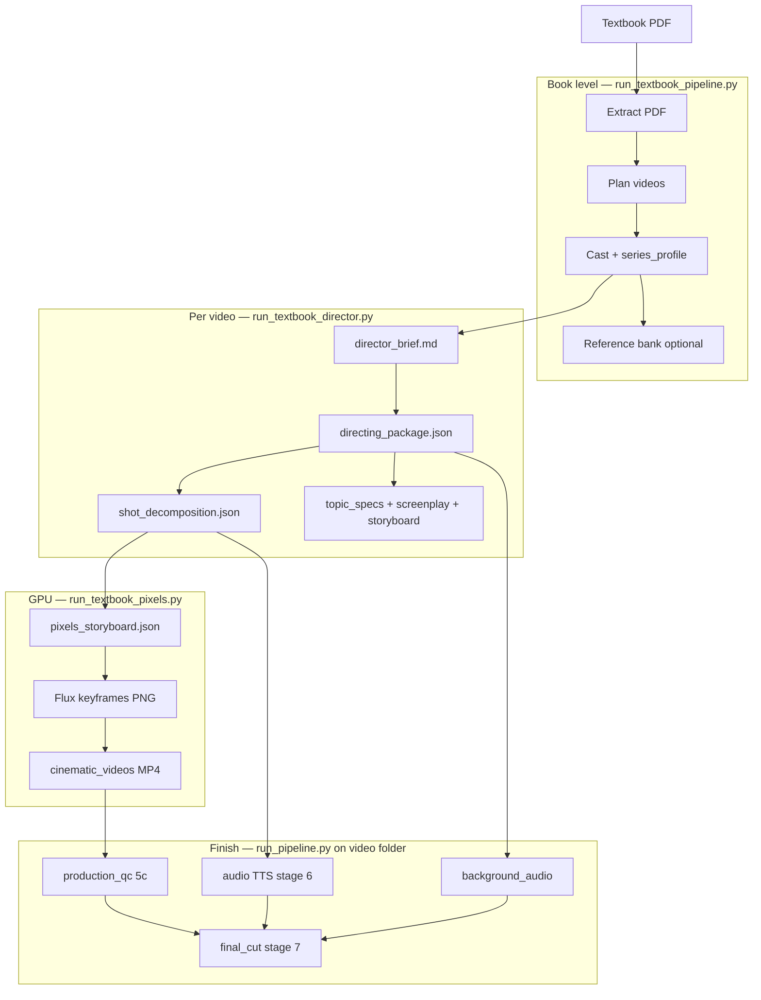

# Entire pipeline — NCERT / DIKSHA textbook → finished MP4

This document describes **end-to-end flow** in EducationContentGeneration: from a textbook PDF to one or more **~8–10 minute explainer videos**, including environments, entry scripts, artifacts, and optional branches.

For module comparisons and roadmap, see [MODULE_COMPARISON.md](./MODULE_COMPARISON.md). Per-command details: [run_textbook_pipeline.md](./run_textbook_pipeline.md), [run_pipeline.md](./run_pipeline.md), root [readme.md](../readme.md).

---

## What the system does

1. **Ingest** a DIKSHA / NCERT PDF and build a chapter + section tree.
2. **Plan** how many videos to produce (one unit per lesson block or LLM grouping).
3. **Bootstrap** a consistent visual identity (cartoon cast **M / F / Y**, series profile, optional multi-angle reference photos).
4. **Direct** each video with Qwen: story beats, VO, scene table, image prompts, BGM cues.
5. **Decompose** the director output into a **shot timeline** (~66 shots for ~10 min) that drives Flux, I2V, and TTS.
6. **Generate pixels**: FLUX keyframes → cinematic clips (MiniMax-H3 via ComfyUI, **LTX**, or MiniMax API).
7. **Audio**: narration TTS, full-timeline background music (Stable Audio), optional SFX cues.
8. **Mux / QC**: validate assets, assemble `final_cut/*.mp4`.

The product shape is a **syllabus-accurate YouTube-style explainer** (hook → beats → mechanism → payoff), not a single long character-animation film. Director rules live in `scripts/knowledge/director_skill.md`.

---

## High-level flow



---

## Runtimes and environments

| Workload | Typical environment | Notes |
|----------|---------------------|--------|
| PDF extract, orchestration, most Python | Project **`.venv`** | `source .venv/bin/activate` |
| Qwen **vLLM** server | **`gsplat_env`** (conda) | Started manually or via `scripts/with_qwen_vllm.sh` |
| LLM stage scripts (director, BGM plan) | **`.venv`** + OpenAI-compatible API | `OPENAI_API_BASE`, `QWEN_MODEL` |
| Flux keyframes, LTX, reference-bank FLUX edits | **`gsplat_env`** | Torch + diffusers; set `HF_HOME` / `HF_HUB_CACHE` |
| Stable Audio (BGM render) | `.stable-audio-tflite/.venv` | `scripts/setup_stable_audio.sh` |

**LLM env (work terminal):**

```bash
export OPENAI_API_BASE=http://localhost:8007/v1
export OPENAI_API_KEY=sk-local
export QWEN_MODEL=Qwen/Qwen3.5-27B
```

**Ephemeral vLLM** (pipeline stays on `.venv`; server spins up in `gsplat_env`):

```bash
./scripts/with_qwen_vllm.sh bash -ec 'python3 scripts/run_textbook_director.py ...'
./scripts/with_qwen_vllm.sh --reuse ...   # if vLLM already on :8007
```

---

## Operational recipe: `run.sh`

Root [`run.sh`](../run.sh) is the **reference end-to-end run** for one book + one `VIDEO_ID`:

| Step | What runs | Skip if artifact exists |
|------|-----------|-------------------------|
| 1 | `run_textbook_pipeline.py --through cast --heuristic-plan` | manifest, plan, cast |
| 2 | `with_qwen_vllm.sh` → `run_textbook_director.py` | `directing/directing_package.json` |
| 3 | `plan_background_music.py --and-generate` | `background_audio/manifest.json` |
| 4 | `build_reference_bank.py` (book-level, gsplat_env) | `series_profile/reference_photos/manifest.json` |
| 5 | `run_textbook_pixels.py` (gsplat_env) | `--skip-existing` |
| 6 | `run_pipeline.py --from-stage 6 --to-stage 6` | VO only |
| 7 | `run_pipeline.py --from-stage 5c --to-stage 7` | QC + mux |

Set `PDF`, `BOOK_ID`, `VIDEO_ID`, and `RUN=output/textbooks/.../videos/...` at the top of `run.sh`.

---

## Phase A — Book-level ingest and plan

**Entry:** `scripts/run_textbook_pipeline.py`

| Step | Script | Outputs under `output/textbooks/<book_id>/` |
|------|--------|-----------------------------------------------|
| **Extract** | `stages/extract_textbook_pdf.py` | `manifest.json`, `extracted/chapters.json`, `extracted/chapters.md` |
| **Plan** | `stages/plan_textbook_videos.py` (LLM) **or** heuristic in `lib/textbook_plan.py` | `video_plan.json` — one row per video + linked sections |
| **Cast** | `stages/bootstrap_textbook_cast.py` | `series_profile/series_profile.json`, copies of [`assets/cartoon/image.png`](../assets/cartoon/image.png) for M/F/Y |
| **Reference bank** (optional) | `stages/build_reference_bank.py` | `series_profile/reference_photos/` — multi-angle FLUX edits from cartoon master |
| **Scripts** (optional in same orchestrator) | Same LLM chain as director minus shot decomposition | per-video `directing/`, `topic_specs/`, `screenplay/`, `storyboard/` |

**CLI shortcuts:**

```bash
# No LLM: extract + heuristic plan + cast only
python3 scripts/run_textbook_pipeline.py --heuristic-plan --through cast --output-root output

# Full book scripts (needs vLLM)
python3 scripts/run_textbook_pipeline.py --heuristic-plan --skip-existing --output-root output
```

**Manifest semantics (DIKSHA lesson PDFs):** one chapter (the lesson) with subchapters such as `topic`, `learning_outcome`, `lesson_block` (RF 1/2/3 tables → video units), `worksheet`. Full NCERT books use heading detection for many chapters.

---

## Phase B — Per-video LLM director and shot timeline

**Entry:** `scripts/run_textbook_director.py` (preferred for textbook units; adds **shot decomposition**)

For each row in `video_plan.json`:

1. **`input/director_brief.md`** — built from `manifest.json` + plan + series profile (`lib/textbook_director_context.py`).
2. **`generate_directing_package.py`** — staged Qwen calls → **`directing/directing_package.json`** (beats, VO script, `scene_table`, `image_prompts`, `audio_cue_sheet`). Exports: `story_overview.md`, `vo_script.md`.
3. **`build_shot_decomposition.py`** — deterministic expansion to **`shots/shot_decomposition.json`**, **`shots/shots.md`**, **`shots/narration_manifest.json`** (per-shot Flux captions, VO lines, timing).
4. **`generate_topic_specs.py`** → `topic_specs/topic_specs.json` (concept specs; social science / general topics).
5. **`generate_screenplay.py`** → `screenplay/screenplay.json`.
6. **`generate_storyboard.py`** → `storyboard/storyboard.json` (LLM shot list; **pixel generation uses shot_decomposition**, not storyboard alone).
7. **`video_production_package.json`** — index of paths.

**Language:** Generated narration scripts are **English**; source PDF may be regional language — brief instructs syllabus fidelity + translation for VO.

```bash
python3 scripts/run_textbook_director.py \
  --book-id <book_id> \
  --video-id <video_id> \
  --max-tokens 16384 \
  --skip-existing \
  --output-root output
```

`--director-only` stops after directing + shot decomposition (fast iteration on story).

---

## Phase C — Background music (full timeline)

Director `audio_cue_sheet` often covers only part of runtime. **`scripts/stages/plan_background_music.py`** plans a full cue sheet from beats + shot timeline, then optionally renders WAVs:

```bash
python3 scripts/stages/plan_background_music.py \
  --directing-package .../directing/directing_package.json \
  --shot-decomposition .../shots/shot_decomposition.json \
  --output-root .../videos/<video_id> \
  --and-generate
```

Outputs: `background_audio/music_cue_sheet.json`, `background_audio/cues/*.wav`, `background_audio/manifest.json`.

This can also run as pipeline stage **6b** when using `run_pipeline.py` with `--directing-package`.

---

## Phase D — Pixels (keyframes + motion clips)

**Entry:** `scripts/run_textbook_pixels.py` (requires **`gsplat_env`**)

**Inputs:** `shots/shot_decomposition.json`, book-level `series_profile/series_profile.json`.

**Steps:**

1. Build **`shots/pixels_storyboard.json`** (`lib/pixels_storyboard.py`).
2. **`generate_storyboard_keyframes.py`** — FLUX.2-dev stills → `shots/keyframes/<scene>/`.
3. **`generate_cinematic_videos.py`** — I2V from keyframes → `cinematic_videos/*.mp4`, `cinematic_prompts.json`, manifest.

**Video backends** (`--video-backend`):

| Backend | Role |
|---------|------|
| `minimax_h3` (default in `run.sh`) | Local ComfyUI MiniMax-H3 I2V |
| `ltx` | Local LTX 2.3 diffusers |
| `minimax_api` | Cloud MiniMax |

Useful flags: `--skip-existing`, `--scene S01`, `--keyframes-only`, `--videos-only`, `--gpu N` (sets `CUDA_VISIBLE_DEVICES`).

Index: `pixels_manifest.json`.

**Insert shots (addon — not a full replacement):**

| Addon | Flag | Stage | Role |
|-------|------|-------|------|
| *(default)* | — | 4b/5a | LTX + Flux for all shots including diagrams |
| Manim | `--enable-manim` | **5b** | LLM-generated Manim for `MATH INSERT` / `CONCEPT` |
| HTML | `--enable-html-inserts` | **5h** | Hand-authored or stub HTML → MP4 (maps, timelines, mechanisms) |

Details: [html_inserts_addon.md](./html_inserts_addon.md). Mux prefers **HTML → Manim → LTX** when flags and files are present.

---

## Phase E — Shared chapter-to-movie stages (`run_pipeline.py`)

**Entry:** `scripts/run_pipeline.py` with `--output-root` pointing at **`output/textbooks/<book_id>/videos/<video_id>/`** (not the book root).

Stage definitions and gates: `scripts/lib/pipeline_utils.py` (`STAGES`). Diagram: [scripts/README.md](../scripts/README.md).

| Stage ID | Name | Script | Primary artifact |
|----------|------|--------|------------------|
| **dir** | directing_package | `generate_directing_package.py` | `directing/directing_package.json` |
| **1** | math_specs | `generate_math_specs.py` | `topic_specs/` or `math_specs/` (legacy layout) |
| **2** | screenplay | `generate_screenplay.py` | `screenplay/screenplay.json` |
| **3** | series_profile | `generate_series_profile.py` | `series_profile/series_profile.json` |
| **3b** | reference_bank | `build_reference_bank.py` | `series_profile/reference_photos/` |
| **4** | storyboard | `generate_storyboard.py` | `storyboard/storyboard.json` |
| **4p** | apply_pacing | `apply_pacing_profile.py` | retimed storyboard (optional) |
| **4b** | storyboard_keyframes | `generate_storyboard_keyframes.py` | keyframe PNGs |
| **5a** | cinematic_videos | `generate_cinematic_videos.py` | `cinematic_videos/manifest.json` |
| **5c** | production_qc | `validate_production_assets.py` | `pipeline/qc_report.json`, contact sheet |
| **5b** | manim_videos | `generate_manim_videos.py` | `manim_videos/manifest.json` (optional) |
| **5h** | html_inserts | `render_html_inserts.py` | `html_inserts/manifest.json` (optional addon) |
| **6** | audio | `generate_audio.py` | `audio/` — narration TTS (`--voice-only` default) |
| **6b** | background_audio | `generate_background_audio.py` | `background_audio/manifest.json` |
| **7** | final_cut | `assemble_final_cut.py` | `final_cut/*.mp4` |

**Typical textbook finish** (as in `run.sh`):

```bash
RUN=output/textbooks/<book_id>/videos/<video_id>

python3 scripts/run_pipeline.py --output-root "$RUN" --from-stage 6 --to-stage 6 --skip-reference-bank
python3 scripts/run_pipeline.py --output-root "$RUN" --from-stage 5c --to-stage 7 --skip-reference-bank
```

`--generation-only` runs **dir → 5a** for a generic chapter folder without final mux. Textbook runs usually split **pixels** (`run_textbook_pixels.py`) from **audio/mux** (`run_pipeline.py`).

---

## Artifact tree (one video unit)

```
output/textbooks/<book_id>/
  manifest.json
  video_plan.json
  extracted/
  series_profile/
    series_profile.json
    reference_photos/          # optional multi-angle cast refs
  videos/<video_id>/
    input/
      director_brief.md
      chapter.md               # same content as brief (legacy name)
    directing/
      directing_package.json
      story_overview.md
      vo_script.md
    shots/
      shot_decomposition.json  # source of truth for pixels + VO timing
      shots.md
      narration_manifest.json
      pixels_storyboard.json
      keyframes/<scene>/*.png
    topic_specs/
    screenplay/
    storyboard/
    cinematic_videos/
    background_audio/
    audio/
    pipeline/                  # state.json, gates, qc_report
    final_cut/*.mp4
    video_production_package.json
    pixels_manifest.json
```

---

## Two orchestration paths (how they relate)

| Path | When to use |
|------|-------------|
| **Textbook** (`run_textbook_pipeline.py` → `run_textbook_director.py` → `run_textbook_pixels.py` → `run_pipeline.py` on video folder) | NCERT/DIKSHA PDFs, many videos per book, shot decomposition from director |
| **Single chapter folder** (`run_pipeline.py` only) | One `output-root`, sample input, or A/B stage experiments |

Textbook flow **reuses the same stage scripts** under `scripts/stages/`; it adds PDF extract/plan/cast and **`build_shot_decomposition.py`** as the bridge between director JSON and Flux/LTX.

---

## Prerequisites checklist

1. **Qwen vLLM** running (see [readme.md](../readme.md)) — port often **8007** on this machine.
2. **`pymupdf`** for PDF extract (`pip install pymupdf` in `.venv`).
3. **GPU** + model weights for Flux/LTX or ComfyUI MiniMax-H3 (see [minimax_h3_local_comfyui.md](./minimax_h3_local_comfyui.md), [generate_flux_images.md](./generate_flux_images.md), [generate_cinematic_videos.md](./generate_cinematic_videos.md)).
4. **Stable Audio** setup for BGM generation (`scripts/setup_stable_audio.sh`).

---

## Related docs (by stage)

| Topic | Doc |
|-------|-----|
| Textbook orchestrator | [run_textbook_pipeline.md](./run_textbook_pipeline.md) |
| Stage orchestrator | [run_pipeline.md](./run_pipeline.md) |
| Flux keyframes | [generate_flux_images.md](./generate_flux_images.md), [generate_storyboard_keyframes.md](./generate_storyboard_keyframes.md) |
| I2V clips | [generate_cinematic_videos.md](./generate_cinematic_videos.md) |
| Manim | [generate_manim_videos.md](./generate_manim_videos.md) |
| HTML diagram addon | [html_inserts_addon.md](./html_inserts_addon.md) |
| TTS / audio | [generate_audio.md](./generate_audio.md) |
| Reference bank | [build_reference_bank.md](./build_reference_bank.md) |
| Series profile | [generate_series_profile.md](./generate_series_profile.md) |
| Architecture / history | [plan.md](../plan.md) |

---

## Quick command map

```bash
# Book: extract → plan → cast (no LLM)
python3 scripts/run_textbook_pipeline.py --pdf "$PDF" --book-id "$BOOK_ID" \
  --heuristic-plan --through cast --output-root output

# One video: director + shots + screenplay chain (LLM)
./scripts/with_qwen_vllm.sh python3 scripts/run_textbook_director.py \
  --book-id "$BOOK_ID" --video-id "$VIDEO_ID" --output-root output

# Pixels (conda gsplat_env)
python3 scripts/run_textbook_pixels.py --book-id "$BOOK_ID" --video-id "$VIDEO_ID" \
  --output-root output --gpu 1 --skip-existing --video-backend minimax_h3

# VO + mux
RUN=output/textbooks/$BOOK_ID/videos/$VIDEO_ID
python3 scripts/run_pipeline.py --output-root "$RUN" --from-stage 6 --to-stage 6 --skip-reference-bank
python3 scripts/run_pipeline.py --output-root "$RUN" --from-stage 5c --to-stage 7 --skip-reference-bank
```

Inspect planned stages without running:

```bash
python3 scripts/run_pipeline.py --dry-run --output-root "$RUN"
```
