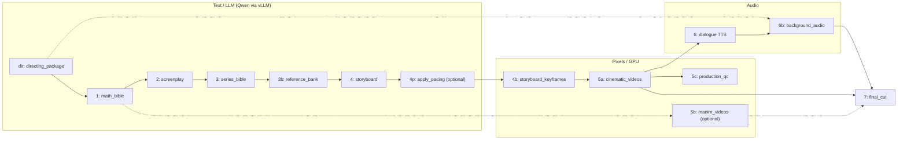

# Scripts layout

Chapter → educational film pipeline. **Entry point:** `run_pipeline.py`.

## Pipeline flow (stage order)



| Stage | Script | Primary output |
|-------|--------|----------------|
| **dir** | `stages/generate_directing_package.py` | `output/directing/directing_package.json` |
| **1** | `stages/generate_math_bible.py` | `output/math_bible/math_bible.json` |
| **2** | `stages/generate_screenplay.py` | `output/screenplay/screenplay.json` |
| **3** | `stages/generate_series_bible.py` | `output/series_bible/series_bible.json` |
| **3b** | `stages/build_reference_bank.py` | `output/series_bible/reference_photos/` |
| **4** | `stages/generate_storyboard.py` | `output/storyboard/storyboard.json` |
| **ref** | `stages/analyze_reference_pacing.py` | `output/pipeline/reference_pacing_profile.json` |
| **4p** | `stages/apply_pacing_profile.py` | Retimes `storyboard.json` from **ref** profile |
| **4b** | `stages/generate_storyboard_keyframes.py` | `output/storyboard/*.png` |
| **5a** | `stages/generate_cinematic_videos.py` | `output/cinematic_videos/manifest.json` |
| **5c** | `stages/validate_production_assets.py` | `output/pipeline/qc_report.json` + `contact_sheet.html` |
| **5b** | `stages/generate_manim_videos.py` | `output/manim_videos/manifest.json` |
| **6** | `stages/generate_audio.py` | `output/audio/audio_plan.json` |
| **6b** | `stages/generate_background_audio.py` | `output/background_audio/manifest.json` |
| **7** | `stages/assemble_final_cut.py` | `output/final_cut/` |

Stage definitions and gates live in `lib/pipeline_utils.py` (`STAGES`). Orchestration: `run_pipeline.py`. Details: [../docs/run_pipeline.md](../docs/run_pipeline.md).

### Common run modes

```bash
python scripts/run_pipeline.py --dry-run
python scripts/run_pipeline.py --generation-only    # dir → 5a (no final cut, skips 3b)
python scripts/run_pipeline.py --from-stage 1 --to-stage 4
python scripts/run_pipeline.py --enable-manim --from-stage 5b --to-stage 7
```

## Textbook PDF → many videos

For a full NCERT PDF (one script package per chapter/unit): **[../docs/run_textbook_pipeline.md](../docs/run_textbook_pipeline.md)**

Entry: `run_textbook_pipeline.py` → `extract` → `plan` → cartoon cast → per-video scripts.

**LLM Director (story + scenes):** `run_textbook_director.py --book-id <id>` — uses `manifest.json` chapter context → `director_brief.md` → `directing_package.json` + screenplay + storyboard.

## Directory map

```
scripts/
  run_pipeline.py          # Orchestrator (stage 0)
  _bootstrap.py            # Adds lib/ to sys.path (imported by entry scripts)
  setup_stable_audio.sh    # BGM/SFX model setup for stage 6b
  run_all_*.sh             # Batch helpers for LTX / Manim

  lib/                     # Shared Python (paths, LLM helpers, gates)
  stages/                  # One script per pipeline stage (table above)
  prompts/                 # LLM prompt templates (# System / # User)
  samples/                 # Example JSON + default chapter input
  knowledge/               # Director skill + research context (not executed)
  legacy/                  # Pre–math-bible/screenplay pipeline (deprecated)
  manim-generator/         # Submodule used by stage 5b
```

## Shared library (`lib/`)

| Module | Role |
|--------|------|
| `paths.py` | Project roots, `output/` layout, `--output-root`, env defaults |
| `pipeline_utils.py` | `STAGES`, gates, `run_script`, `run_llm_json` |
| `gemma_utils.py` | Local Gemma + prompt template loading |
| `qwen_utils.py` | Qwen via OpenAI-compatible vLLM API |
| `dialogue_utils.py` | Screenplay/storyboard dialogue limits |
| `cast_reference_utils.py` | Cast photo resolution for Flux keyframes |

## Knowledge (reference only)

- `knowledge/director_skill.md` — NCERT explainer director rules (stage **dir**)
- `knowledge/context.md` — Channel decomposition research (human reference)

## Legacy scripts

Older flow (`problem_statement` → `image_video` → Flux/LTX prompts). Replaced by stages **1–5a**; see [../plan.md](../plan.md). Still runnable from `legacy/` for comparison.
